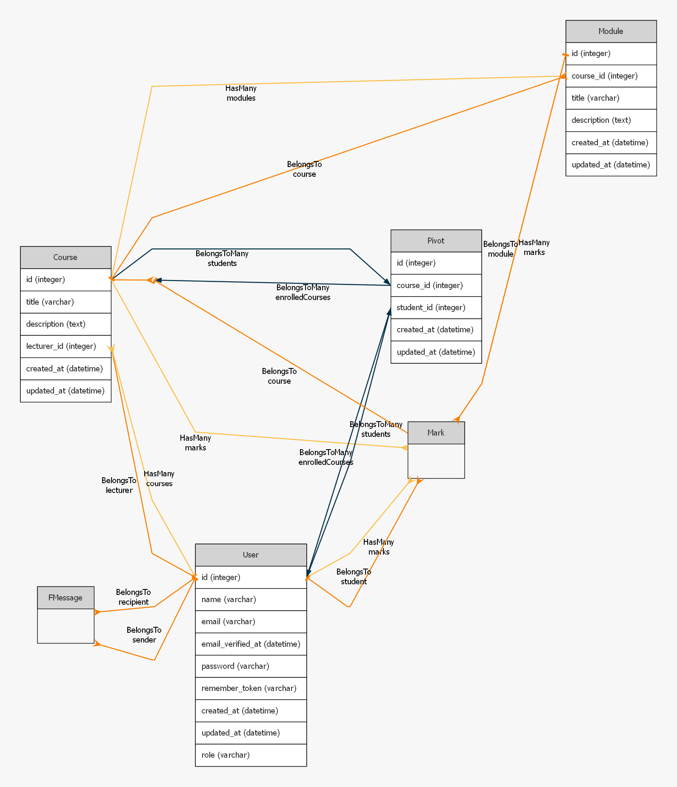

# UniPortal

UniPortal is a web-based academic management platform for students and administrators.

---

## Technologies & Frameworks Used

- **Backend:** [Laravel 12](https://laravel.com/)
- **Frontend:** Blade templating, HTML, CSS,Tailwind
- **Database:** SQLite (default, easily switchable to MySQL/PostgreSQL)
- **PDF Generation:** [barryvdh/laravel-dompdf](https://github.com/barryvdh/laravel-dompdf)
- **Authentication:** Laravel Breeze/Jetstream (or similar, depending on your setup)
- **Other:** Composer, PHP 8.4+

---

## Setup & Installation

1. **Clone the repository:**
   ```bash
   git clone https://github.com/yourusername/UniPortal.git
   cd UniPortal
   ```

2. **Install dependencies:**
   ```bash
   composer install
   npm install && npm run build # if using Laravel Mix/Vite for assets
   ```

3. **Environment setup:**
   - Copy `.env.example` to `.env` and update as needed.
   - For SQLite (default), ensure this line in `.env`:
     ```
     DB_CONNECTION=sqlite
     DB_DATABASE=database/database.sqlite
     ```
   - Create the SQLite file if it does not exist:
     ```bash
     touch database/database.sqlite
     ```

4. **Generate application key:**
   ```bash
   php artisan key:generate
   ```

5. **Run migrations and seeders:**
   ```bash
   php artisan migrate --seed
   ```

6. **(Optional) Install DomPDF for PDF reports:**
   ```bash
   composer require barryvdh/laravel-dompdf
   ```

7. **Start the development server:**
   ```bash
   php artisan serve
   ```

---

## Usage Guide

### User Registration & Login

- Visit `/register` to create a new student or admin account.
- Login at `/login` with your credentials.

### Student Features

- **Dashboard:** View enrolled courses, average grades, and upcoming exams.
- **Enroll in Courses:** Browse and enroll in available courses.
- **Progress Report:** View and download your academic progress as a PDF.
- **Profile:** Update your personal information.

### Posting (if applicable)

- Students and admins can post announcements or messages (describe how, if your app supports this).

### Administrative Functions

- **User Management:** Admins can view, edit, or remove users.
- **Course Management:** Create, update, or delete courses and modules.
- **Grades:** Assign or update marks for students.
- **Reports:** Generate and download student progress reports as PDFs.

---

## Code Documentation

- **Inline Comments:** Complex logic in controllers, models, and views is explained with comments.
- **Blade Views:** Each Blade file contains comments for major sections.
- **Controllers:** Methods include PHPDoc blocks describing their purpose and parameters.

---

## Example: PDF Progress Report

The PDF report is generated using the `barryvdh/laravel-dompdf` package.  
See `resources/views/students/progress-report-pdf.blade.php` for the template.

```php
// Controller example
use Barryvdh\DomPDF\Facade\Pdf;

public function progressReportPdf()
{
    $student = Auth::user();
    $courses = $student->enrolledCourses()->with(['modules', 'modules.marks' => function($query) use ($student) {
        $query->where('student_id', $student->id);
    }])->get();

    $pdf = Pdf::loadView('students.progress-report-pdf', compact('courses', 'student'));
    return $pdf->download('progress-report.pdf');
}
```



---

## License

[MIT](LICENSE) or your chosen license.

---

## Contact

For questions or support, contact [Franco Lukhele - 222462914@mycput.ac.za ].
